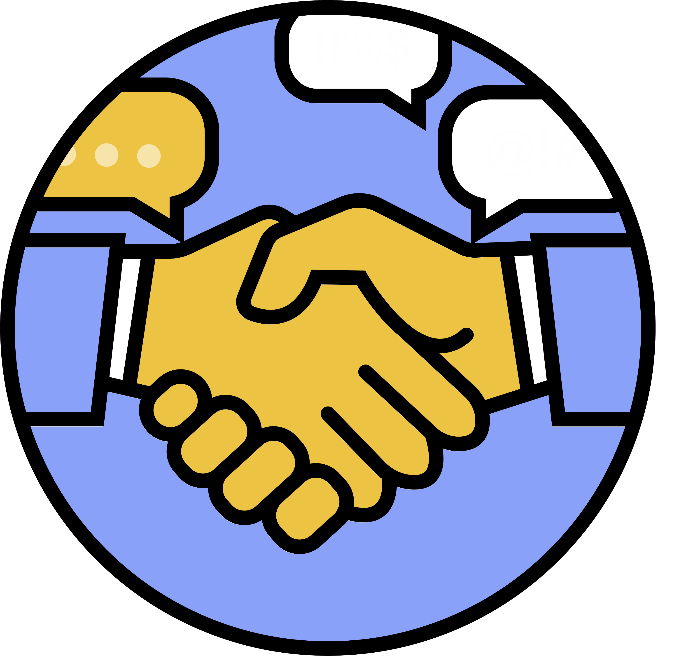

# The Safe Place : Plateforme MOOC Éducative contre le CyberHarcelement

---

## Introduction

"The Safe Place" est une plateforme éducative MOOC (Massive Open Online Courses) innovante, conçue pour prévenir le cyberharcèlement en sensibilisant et en éduquant les élèves et leurs parents. Face à l'augmentation alarmante des cas de cyberharcèlement, qui affecte près de 1 jeune sur 3 en Europe, notre mission est d'intervenir avant que le harcèlement ne se produise, par une éducation proactive et préventive.

---

## Contexte
Le cyberharcèlement représente une menace sérieuse pour le bien-être et la sécurité des jeunes sur internet. Contrairement aux solutions traditionnelles qui interviennent pendant ou après les incidents, "The Safe Place" adopte une approche préventive, en équipant les élèves et les parents des connaissances et des outils nécessaires pour reconnaître, prévenir et agir contre le cyberharcèlement.

---

## Fonctionnalités
- **Espace Élève** : Accès aux cours, réalisation de quizz, soumission d'évaluations, consultation des notes et suivi de la progression.
- **Espace Parent** : Suivi de la progression de l'enfant, consultation des notes et conseils pour accompagner son enfant.
- **Gestion des Utilisateurs** : Inscription et authentification sécurisée (hashage) pour les élèves et les parents.
- **Administration des Cours** : Ajout, modification, et suppression de cours par les administrateurs.
- **Quizz et Évaluations** : Création de quizz interactifs et d'évaluations pour tester les connaissances des élèves.
- **Accès Sécurisé et Personnalisé** : Une personne non connectée ne peut accéder qu'à la page d'accueil et à la page de ressources, tandis qu'un élève connecté a également accès à l'espace élève, et un parent connecté à l'espace parent.

---

## Technologies Utilisées

| Catégorie         | Technologies              |
|-------------------|---------------------------|
| Frontend          | HTML, CSS, JavaScript     |
| Backend           | PHP                       |
| Base de Données   | MySQL                     |

---

## Configuration Requise
- Serveur Web Apache
- PHP version 7.4 ou supérieure
- MySQL version 5.7 ou supérieure

---

## Installation
1. Clonez le dépôt Git sur votre serveur local ou hébergé : `git clone https://exempledepot.com/TheSafePlace.git`
2. Importez le script SQL `thesafeplace.sql` fourni dans votre base de données MySQL pour créer les tables nécessaires.
3. Modifiez le fichier `../php/db.php` pour renseigner vos informations de connexion à la base de données.
4. Accédez à votre projet via un navigateur web en naviguant vers l'URL du dossier du projet.

---

## Utilisation
La plateforme "The Safe Place" est conçue pour être intuitive et facile d'accès pour tous les utilisateurs, offrant des espaces distincts et sécurisés pour les élèves et les parents.

### Pour les Élèves

- **Inscription** : Les élèves commencent par s'inscrire sur la plateforme en remplissant un formulaire d'inscription. Ce formulaire demande des informations de base comme le nom, prénom, classe, ainsi qu'un identifiant et un mot de passe pour sécuriser l'accès.
- **Accès aux Cours** : Une fois connectés, les élèves ont accès à une bibliothèque de cours, vidéos éducatives et quizz adaptés à leur niveau scolaire. Ces ressources sont conçues pour aider les élèves à comprendre et à combattre le cyberharcèlement de manière interactive et engageante.
- **Réalisation de Quizz et Évaluations** : Les élèves peuvent tester leurs connaissances sur le cyberharcèlement à travers des quizz interactifs et des évaluations. Ces activités sont personnalisées en fonction du niveau scolaire de l'élève et permettent un suivi de la progression.
- **Consultation des Notes** : Après avoir complété les évaluations, les élèves peuvent consulter leurs notes et recevoir des retours sur leur performance. Cela leur permet de mesurer leur progression et de s'auto-évaluer.

### Pour les Parents

- **Connexion** : Les parents accèdent à l'espace parent après avoir créé un compte et lié ce dernier à leur enfant. Cette connexion sécurisée garantit que les parents ont accès uniquement aux informations concernant leur propre enfant.
- **Suivi de la Progression** : Dans l'espace parent, un tableau de bord offre un aperçu de la progression de l'enfant dans les différentes activités de la plateforme. Les parents peuvent voir les cours suivis par leur enfant, les notes obtenues aux quizz et évaluations, ainsi que les éventuels domaines à améliorer.
- **Conseils et Ressources** : L'espace parent propose également des conseils et des ressources pour aider les parents à accompagner leurs enfants dans la lutte contre le cyberharcèlement. Cela inclut des stratégies de communication, des signes d'alerte à surveiller et des manières d'encourager la résilience chez leur enfant.

---

## Structure de la Base de Données `thesafeplace`

| Table        | Champs                                                                 |
|--------------|------------------------------------------------------------------------|
| `eleves`     | `eleve_id`, `classe`, `nom`, `prenom`, `code_etablissement`, `password`, `username`, `age` |
| `evaluation` | `id`, `classe`, `question`, `option_1`, `option_2`, `option_3`, `option_4`, `correct_option` |
| `notes`      | `id`, `note`, `eleve_id`, `timestamp`, `try`                          |
| `parents`    | `parent_id`, `nom`, `prenom`, `password`, `username`, `enfant_id`     |
| `quizz`      | `id`, `classe`, `question`, `option_1`, `option_2`, `option_3`, `option_4`, `correct_option`, `numero` |
| `videos`     | `video_id`, `name`, `classe`                                          |

### Détails

- **eleves** : Contient les informations des élèves inscrits.
- **evaluation** : Stocke les questions d'évaluation avec les options et la bonne réponse.
- **notes** : Enregistre les notes obtenues par les élèves pour chaque évaluation.
- **parents** : Détient les informations des parents liés à un ou plusieurs élèves.
- **quizz** : Répertorie les quizz par classe, chaque quizz ayant des questions, des options de réponse et une option correcte.
- **videos** : Contient les vidéos éducatives disponibles, classées par niveau scolaire.

Ces tables permettent une gestion dynamique du contenu en fonction du niveau des élèves, ainsi qu'un suivi personnalisé des progrès des élèves par leurs parents. La plateforme assure que l'accès aux différents espaces (élève, parent) est sécurisé et adapté au profil de chaque utilisateur.

---

## Contribution
Les contributions à ce projet sont les bienvenues. Si vous souhaitez contribuer, veuillez forker le dépôt, créer une branche pour vos modifications, puis soumettre une pull request.

---

## Support
Pour toute demande de support, veuillez ouvrir un issue dans le dépôt Git du projet.

---

Créé avec par Alexandre, Camille, Hugo, Ines, Jules & Mathéo

